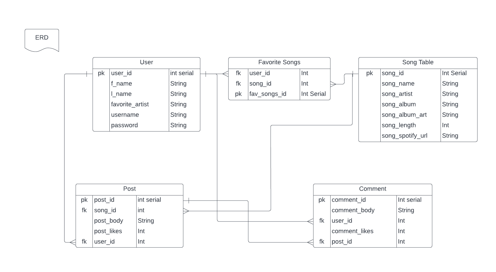
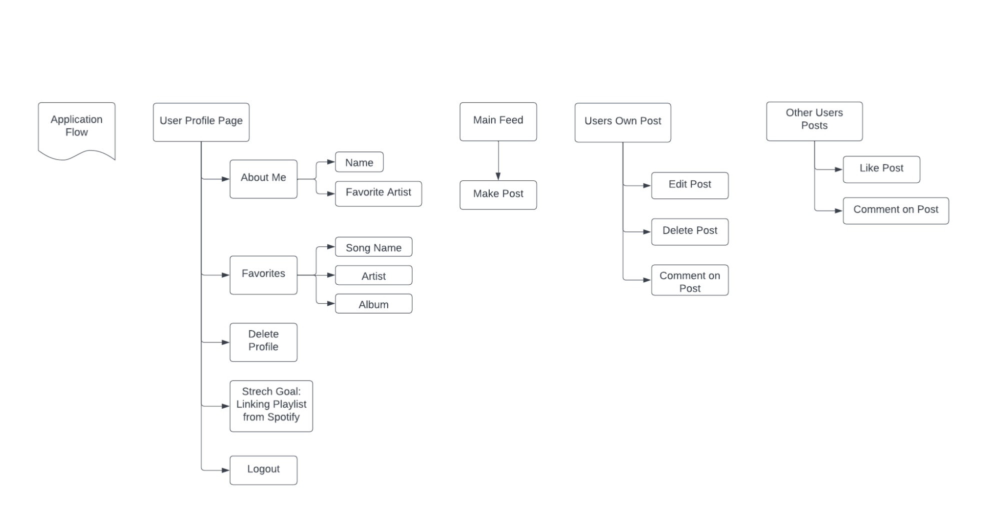

# Project 2 - Team Alchemy
 Yes, there is a school of wizards!

## Team Members
- Markus Grier - Git Master
- Chris Osborne - Team Leader
- Jorge Galeana - Dev Ops Engineer
- Yugal Subedi - Wizardly Scribe
- Jacob Shaw - Support Engineer

## Project Introduction:
We will be creating a music based social media platform, where users can share and discuss the music they like with other people. 

## Tech Stack:
- Spring Framework
- Java 8
- PostGreSQL
- HTML
- CSS3
- JavaScript
- Spring Data JPA
- CI/CD Pipelines
- AWS RDS
- Elastic Beanstalk
- External API Implementation
- AWS EC2
- AWS S3
- Jacoco
- Log4J
- Swagger
- JUnit Tests

## API: Spotify Web API
We will use this API to retrieve song information when a User adds a song to their profile or a post.

## User Stories
- User can register
- User can login
- User Can Create Post
- User Can Edit Post
- User Can Delete Post
- User Can Search for a Song
- User can link a song to their post
- User can add their favorite songs to their profiles
- User can add their favorite artists to their profiles
- User can view other user’s favorite songs
- User can comment on other user’s posts
- User can like other user’s posts
- User can comment on other user’s profiles
- User can search for other users
- User can follow other users

## Stretch Goals:
Embedded spotify song previews in posts, so others can hear a brief snippet without having to open spotify.
Users can add a spotify playlist to their profile that plays song previews. 
Admins can delete posts, comments, and profile’s directly from the webpage. 
## ERD
 

 

 

 

## Application Flow
 

 

## HTML Pages
 

 
 

# Swagger Documentation

## Testing URL
- Program must be running first
- http://localhost:8080/swagger-ui.html#/

## User Related

 
 

## Demo Sending User Creation Query

 

 
 

## Song Related

 
 

## Favorite Song Related

 
 

## Post Related

 
 

## Comment Related

 
 

## Demo Comment Showing Connection to Post, Song, and User

 